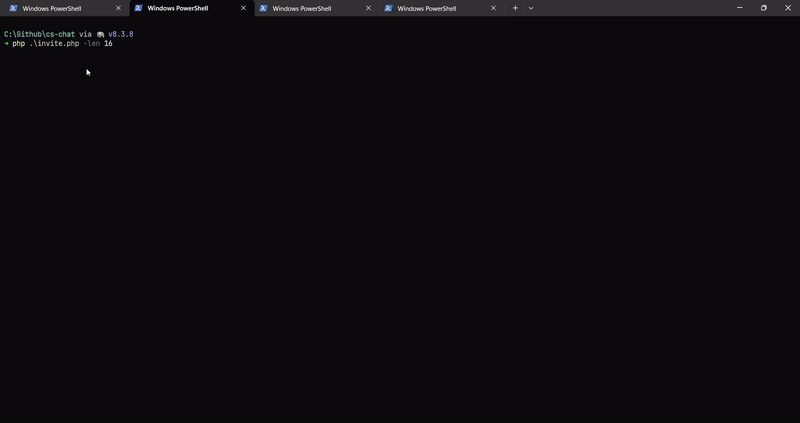

# CS Chat

An invite only basic messaging app following a Client-Server framework whereby the server is responsible for message forwarding to facilitate communication between the clients. Generating invitation keys and registering credentials is done with a simple PHP App.



## Test Run

### Generate Invite Link
1. The chat is authenticated so to create an account you need to create/receive a registration link first:
```
php invite.php -len 20
```

> **Hint:** -len option specifies the length of the registration key. The script will by default generate a
> link to http://localhost:8080/register.php?key=<what.ever.key.was.generated>

2. Host the project folder, that is the repository root, so you can access the link generated by the `invite.php` script. The address can ofcourse be changed and subsquently the details of the link if you copy and paste.

### Register Account
1. Visit the invite link on the hosting address, i.e. `http://localhost:8080/register.php?key=<what.ever.key.was.generated>` and register an account. The next steps will be to setup a chat server and connect for chatting.

### Run CS-Chat Server
1. Run the server, `server/server.py` - by default it listens on `0.0.0.0:178`. Specify `../data/.authfile` as the path to the authfile used for basic authentication.
```
python server/server.py -af ../data/.authfile
```

2. Connect to the server with either the app or the python client:

### Connect with the App
**Step 1:**
- Windows: Extract and run cs_chat_app.exe from builds/windows.zip
- Android: Install builds/android/cschat-release.apk and run the app

**Step 2**
- The first input field in the app is for connecting to the server. Connect to the server at the
hosting address, ex. 192.168.1.100:178

**Step 3**
- Enter whatever username:password you registerd. If none registered then you can use wiener:peter. 

#### Connect with the `python` Client
1. Run the command, where `1.2.3.4` should be the address of the hosting machine.
```
python3 client/client.py -svr 1.2.3.4 -p 178
```

Otherwise, enjoy!!
